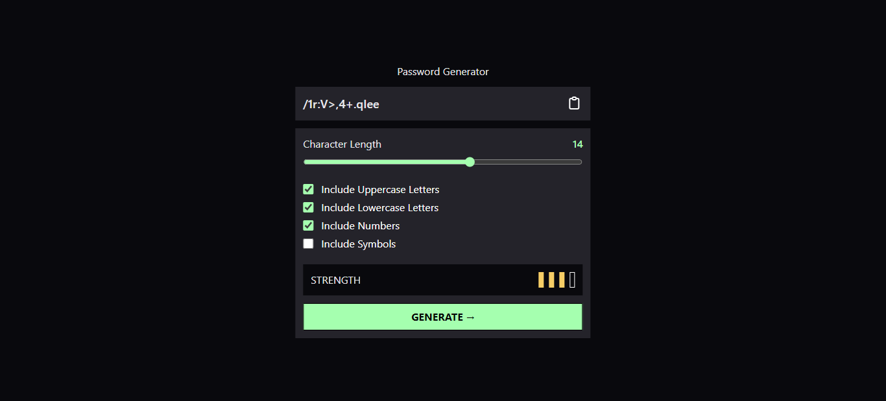

# React Password Generator App



This is a secure and customizable password generator web application built using React. It enables users to create strong and unique passwords for their online accounts, enhancing their digital security. The app allows users to specify password length and character sets, ensuring compatibility with various password requirements.

## Table of Contents
- [Features](#features)
- [Getting Started](#getting-started)
  - [Prerequisites](#prerequisites)
  - [Installation](#installation)
- [Usage](#usage)
- [Technical Details](#technical-details)
- [Contributing](#contributing)
- [License](#license)

## Features

- **Customizable Passwords**: Specify password length and character sets (uppercase, lowercase, numbers, symbols).
- **Secure and Strong**: Generate complex and secure passwords for your online accounts.
- **Randomized Output**: Passwords are generated with a high degree of randomness.
- **User-Friendly Interface**: Intuitive design for easy usage.
- **Responsive Design**: Ensures functionality across various devices.

## Getting Started

Follow these instructions to set up and run the project locally.

### Prerequisites

Make sure you have the following software installed:

- **Node.js**: Download and install it from [nodejs.org](https://nodejs.org/).

### Installation

1. Clone the project repository:

   ```shell
   git clone https://github.com/tncrayt/password-generator.git
   ```

2. Navigate to the project directory:

   ```shell
   cd react-password-generator
   ```

3. Install project dependencies:

   ```shell
   npm install
   ```

   or

   ```shell
   yarn install
   ```

4. Start the application:

   ```shell
   npm start
   ```

   or

   ```shell
   yarn start
   ```

   This will launch the development server, and you can access the app in your default web browser.

## Usage

Once the app is running, you can configure password settings, including length and character types. Click the "Generate Password" button to create a password based on your specifications.

## Technical Details

The application is built with React, making use of React state management for user interactions. Password generation is handled using JavaScript's secure random number generation functions. The app employs modern web development techniques, including CSS Flexbox for responsive layout design.

## Contributing

Contributions are welcome! If you find bugs, have feature requests, or want to contribute to the project in any way, please open an issue or submit a pull request. Your contributions will help enhance the project.

## License

This project is licensed under the MIT License. Please see the [LICENSE](LICENSE) file for details.
